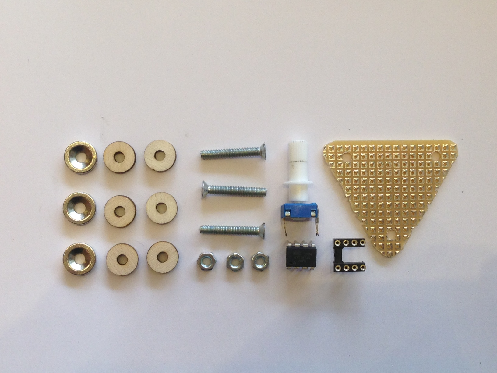
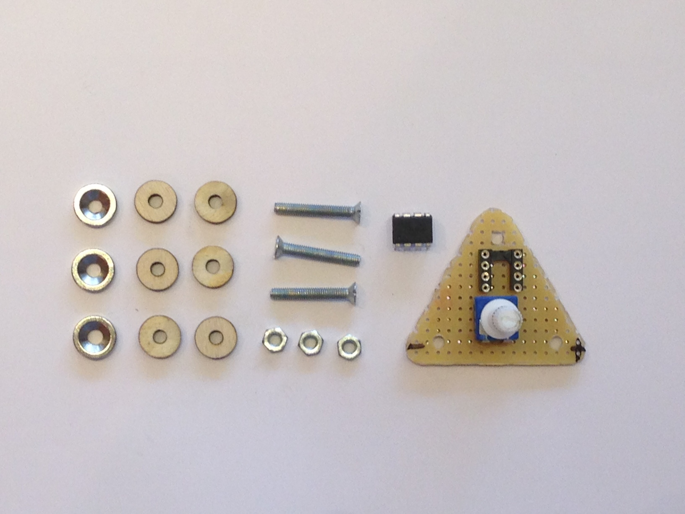
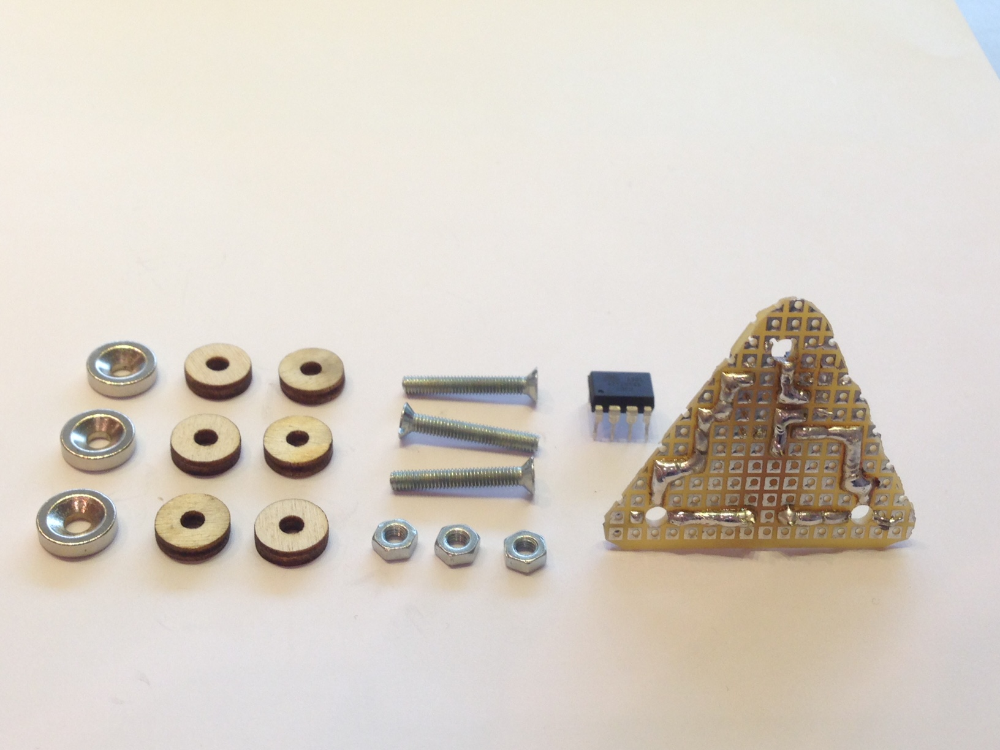
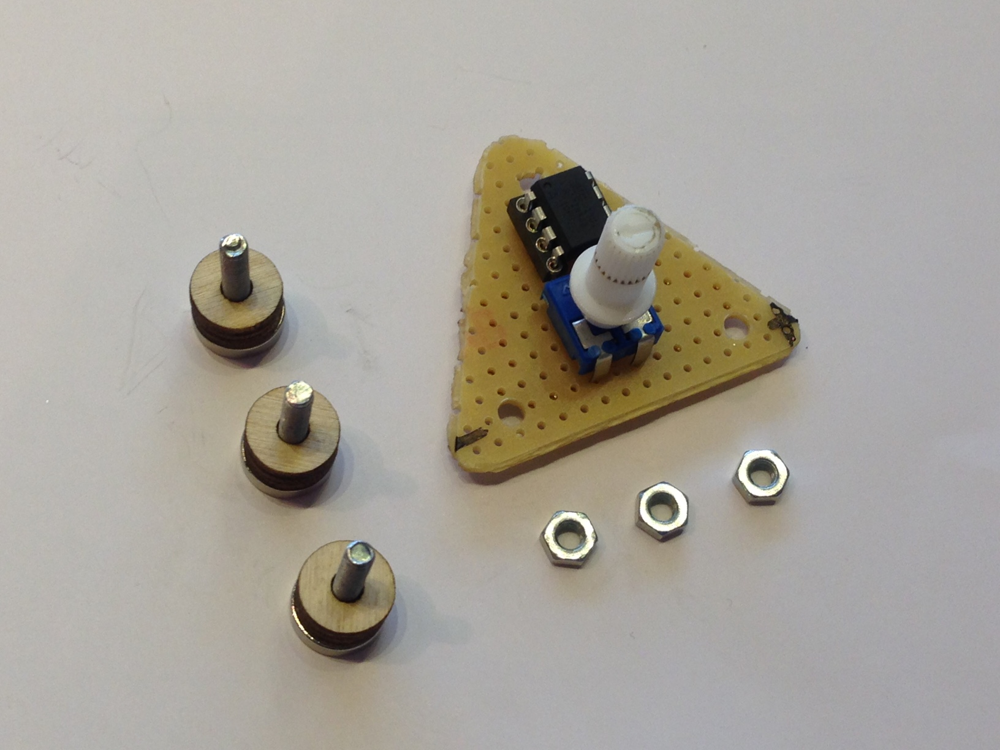
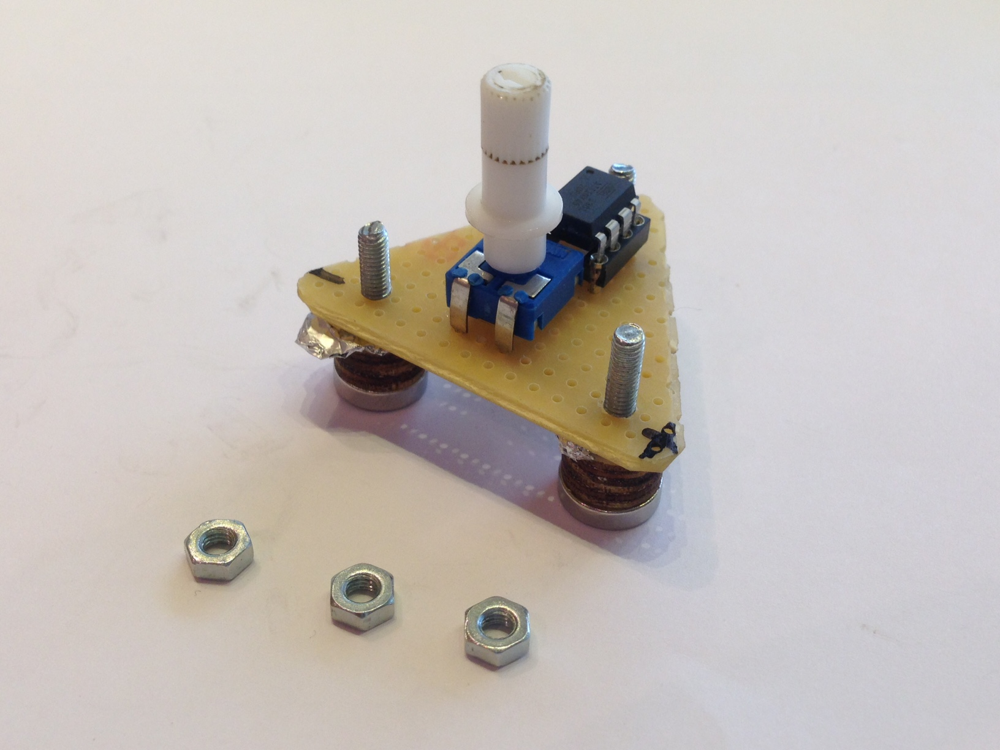
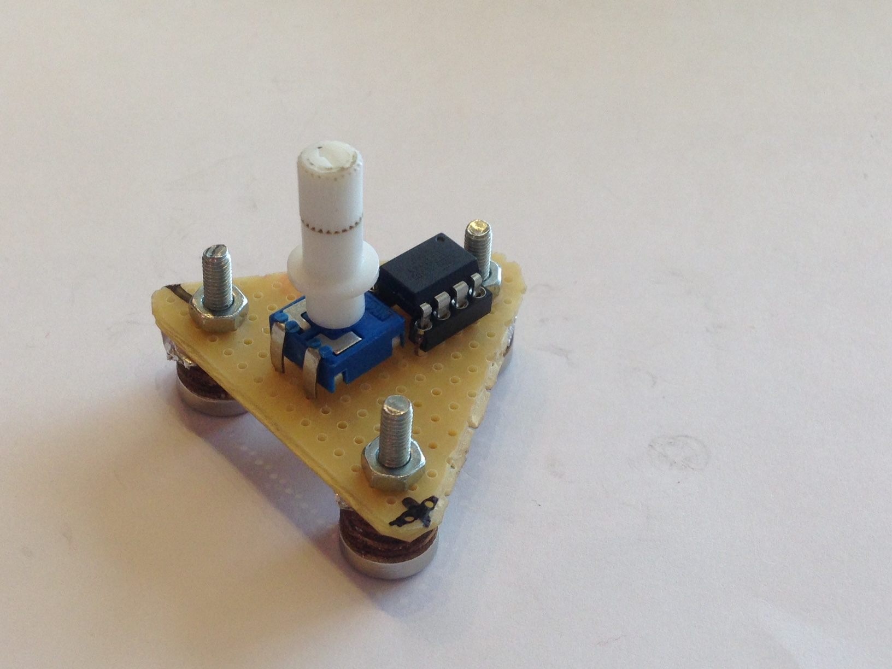

# Istruzioni di assemblaggio di moduli su basetta millefori

I moduli che richiedono assemblaggio su basetta millefori sono double
switch e blinker. Di seguito sono riportare le istruzioni di
assemblaggio di un modulo blinker, è possibile assemblare il restante
modulo analogamente basandosi sulle forografie riportate nella cartella
[PICTURES](https://github.com/TizianaDallape/Circuit_making/tree/master/pictures).

01) Ritagliare la basetta millefori con le misure adeguate descritte nel
[disegno quotato](https://github.com/TizianaDallape/Circuit_making/blob/master/drawings/blinker_dimensions.pdf)
(cartella [DRAWINGS](https://github.com/TizianaDallape/Circuit_making/tree/master/drawings);
i fori in cui inserire le viti devono essere trapanati con punta da
d=3mm.
</img>

02) Gli schemi elettrici da saldare possono essere visualizzati nella
cartella [SCHEMATICS](https://github.com/TizianaDallape/Circuit_making/tree/master/schematics).
Quindi saldare i componenti.
Nota Bene: In relazione al modulo
[blinker](https://github.com/TizianaDallape/Circuit_making/blob/master/pictures/through-pass-hole_assembly_instructions/05.JPG)
è necessario programmare l'ATtiny45 tramite Arduino ([documentazione](https://github.com/PeriniMatteo/Arduino-shield-attiny45)
del procedimento) prima della saldatura.
</img>
</img>

03) Inserire in ogni vite con cappuccio rivolto verso il basso un dischetto
magnetico e due dischetti in compensato e l'ATtiny45 nel supporto
presaldato sulla basetta millefori prestando attenzione alla
configurazione elettronica degli elementi.
</img>

04) Inserire le viti nei fori predisposti della basetta e assicurarsi
dell'esitenza del contatto elettrico tra il percorso di saldatura e le
viti che andranno a contatto con il circuito disegnato su foglio.
Eventualmente incastrare della carta alluminio o altro materiale sottile
conduttivo tra basetta e dischetti che garantisca il ponte.
</img>

05) Fissare le viti nella parte superiore tramite i dadi.
</img>
