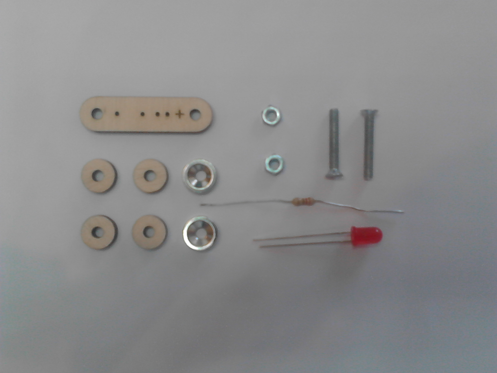
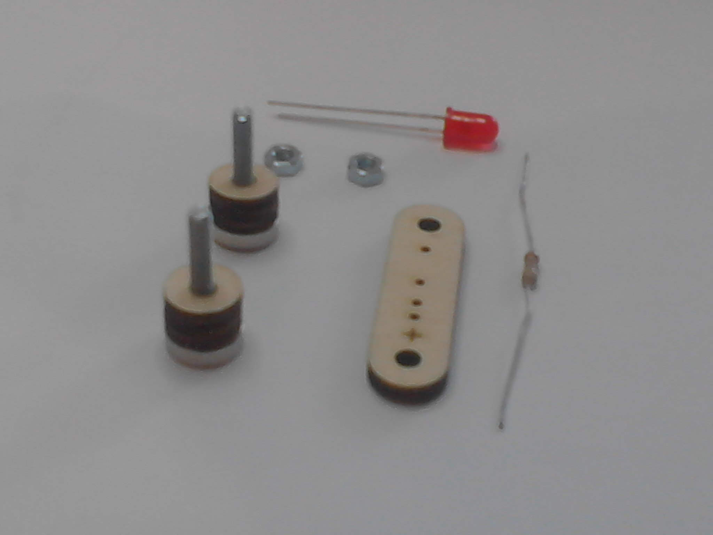
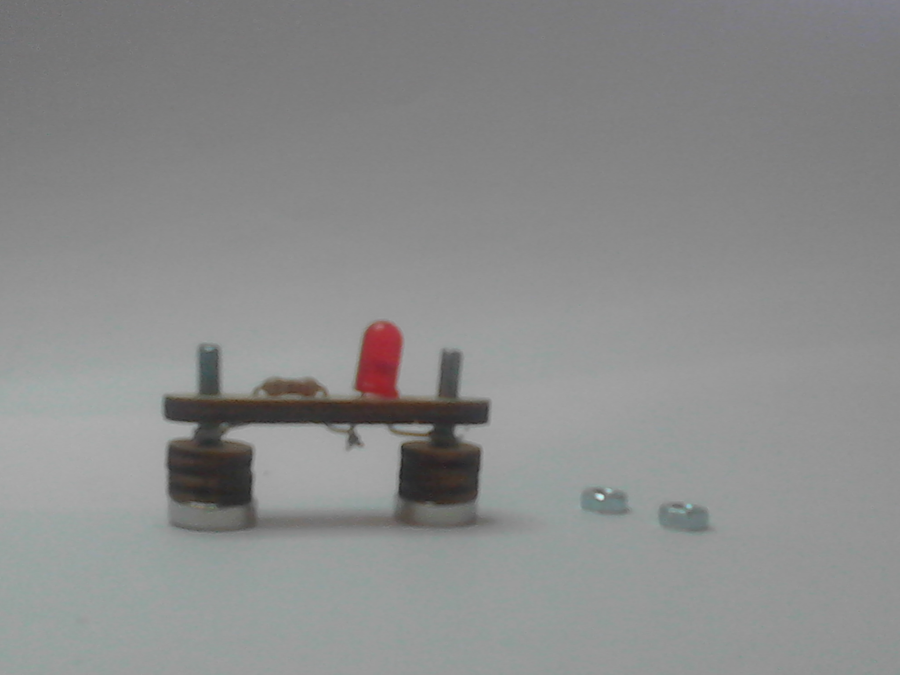
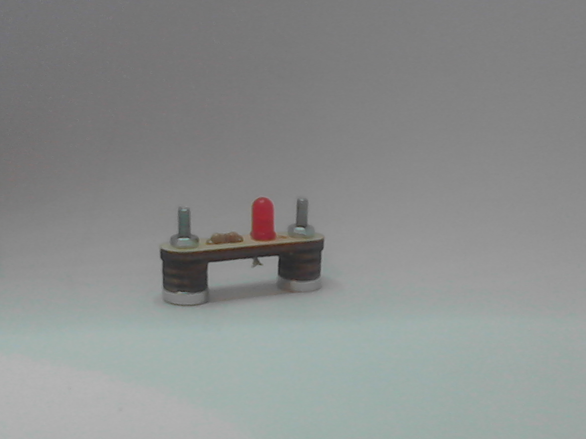

# Istruzioni di assemblaggio di moduli su basetta in compensato

I moduli che richiedono assemblaggio su basetta in compensato sono
alimentazione 9V, potenziometro, sensore di luminosità LDR, LED, e 
buzzer. Di seguito sono riportare le istruzioni di assemblaggio di un
modulo LED, è possibile assemblare i restanti moduli analogamente
basandosi sulle forografie riportate nella cartella [PICTURES]().

Ritagliare la basetta ed i componenti.
</img>

Inserire in ogni vite con cappuccio rivolto verso il basso un dischetto
magnetico e due dischetti in compensato.
</img>

Inserire i componenti elettronici nei forellini centrali della basetta
prestando attenzione alla giusta configurazione elettrica.
</img>

Inserire le viti nei fori predisposti della basetta e congiungere i fili
dei componenti arrotolandoli tra loro e attorno all'asse delle viti tra
basetta e dischetti.
</img>

Fissare le viti nella parte superiore tramite i dadi.
</img>
